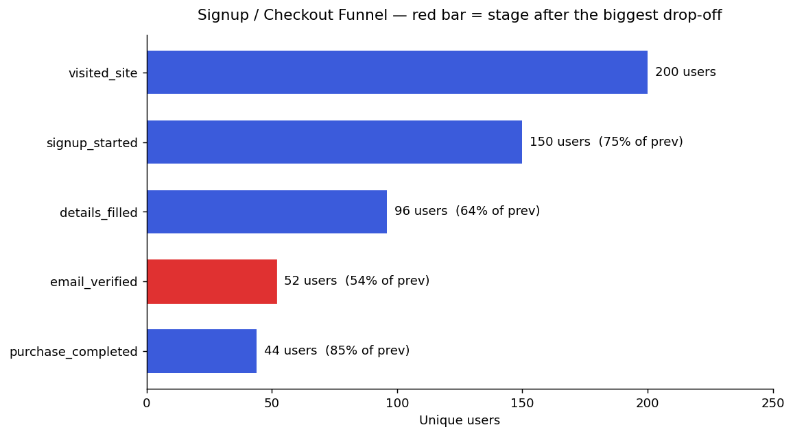

# Funnel Drop-off Analysis

Analysis of a signup / checkout funnel: unique users per stage, stage-to-stage
conversion rates, and identification of the single biggest drop-off point.

**Funnel order:** `visited_site → signup_started → details_filled → email_verified → purchase_completed`

## Key results

| Stage | Unique users | Conversion vs previous | Users lost |
|---|---|---|---|
| visited_site | 200 | — | — |
| signup_started | 150 | 75.0% | 50 |
| details_filled | 96 | 64.0% | 54 |
| email_verified | 52 | **54.2%** | 44 |
| purchase_completed | 44 | 84.6% | 8 |

**Biggest drop-off:** `details_filled → email_verified` — **45.8%** of users are lost
here (the worst stage-to-stage conversion). By raw volume, `signup_started → details_filled`
loses the most single users (54). Once users verify their email, 84.6% go on to purchase,
so the friction is mid-funnel, not at checkout.



## What's in this repo
- `funnel_dropoff_analysis.ipynb` — full analysis with data-quality checks, conversion
  logic, automated drop-off flagging, funnel chart, and bonus sections
  (time-to-convert, segment comparison, recommendation).
- `funnel_events_sample.csv` — source event-level dataset.
- `funnel_chart.png` — rendered funnel visualization.

## Method (short)
1. Load events; run data-quality checks (duplicates, missing values, unknown steps, users with gaps).
2. Count **unique users** per stage in the fixed funnel order.
3. Compute **stage-to-stage** conversion (% of the *previous* stage, not overall completion).
4. Programmatically flag the biggest drop-off — by conversion rate and by raw users lost.
5. Visualize the funnel and add bonus analyses.

## Run it
```bash
pip install pandas numpy matplotlib jupyter
jupyter notebook funnel_dropoff_analysis.ipynb
```
